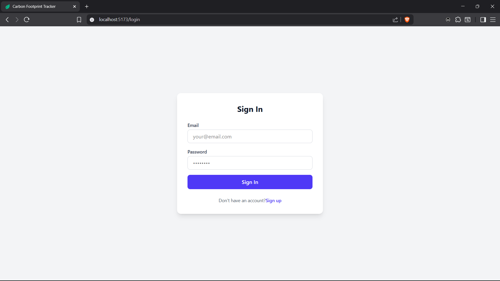
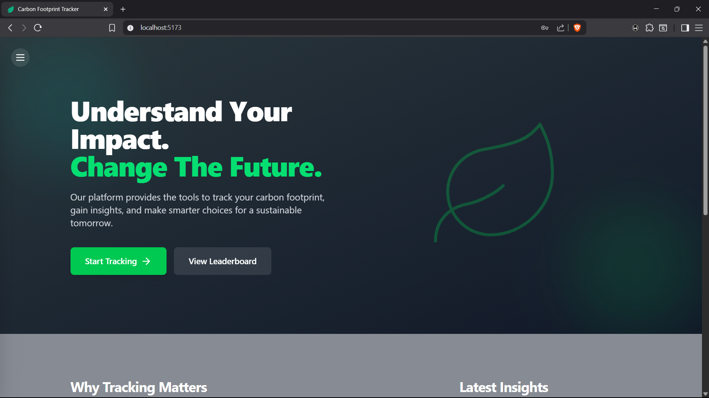
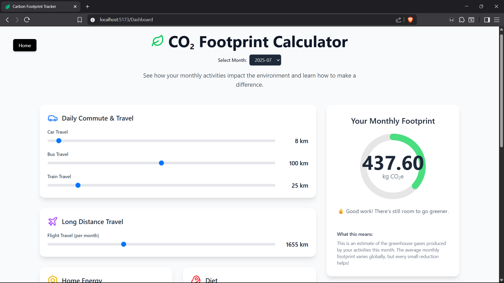
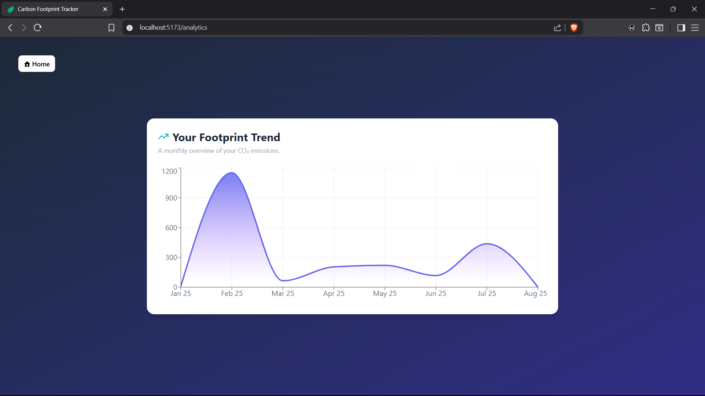

<h2> 🌱 Carbon Footprint Tracker </h2>

Hey there! 👋 This app is ready to help you understand and reduce your carbon footprint. Dive in and start making a difference!

---

<h3>What's Inside? 🚀</h3>

- 📱 Activity Logging: Easily log your daily activities across transport, food, and energy consumption.

- 💨 Carbon Calculation: Get instant estimates of your carbon emissions based on your logged activities.

- 📊 Personal Dashboard: Visualize your carbon footprint with an intuitive and personal dashboard.

- 🌟 Reduction Tips: Discover personalized and actionable tips to lower your emissions.

- 📈 Progress Tracking: Monitor your carbon footprint over time and see the positive impact you're making.

---

<h3>Tech Stack 💻</h3>

<h4>Frontend:</h4>

- ⚛️ React + Vite

- 🎨 Tailwind CSS

<h4>Backend:</h4>

- 🖥️ Node.js/Express

- 🍃 MongoDB (Mongoose)

---
<h3>📸 Screenshots & Demo</h3>

Here’s a sneak peek into the application.

- <h4>Login Page</h4>
    

---

- <h4>Home Page</h4>
    

---

- <h4>Dashboard</h4>
    
---

- <h4>Analysis</h4>
    

- <a src='https://drive.google.com/file/d/1Dd_k-RCQ7xa-rKMW4URJ1qTQ1Mh5uE_G/view?usp=sharing'><h4>Demo Video</h4></a>
---

Let me know your thoughts and/or suggestions. ☺️